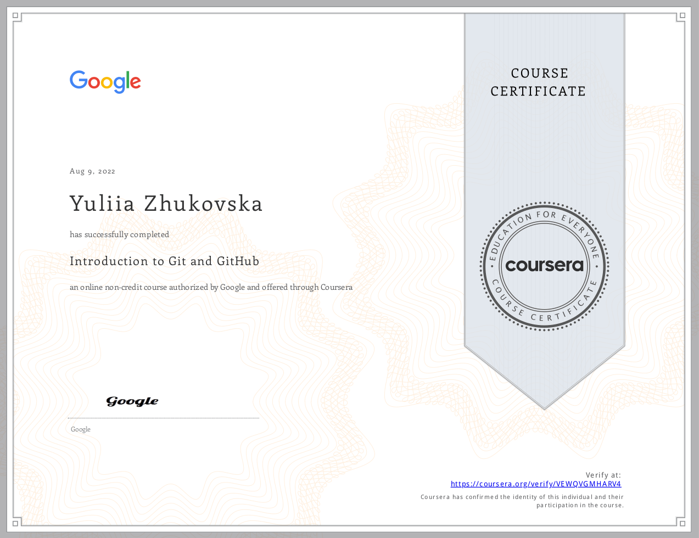
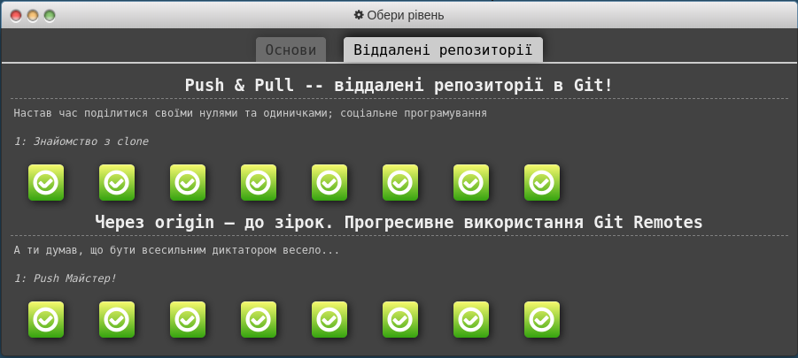
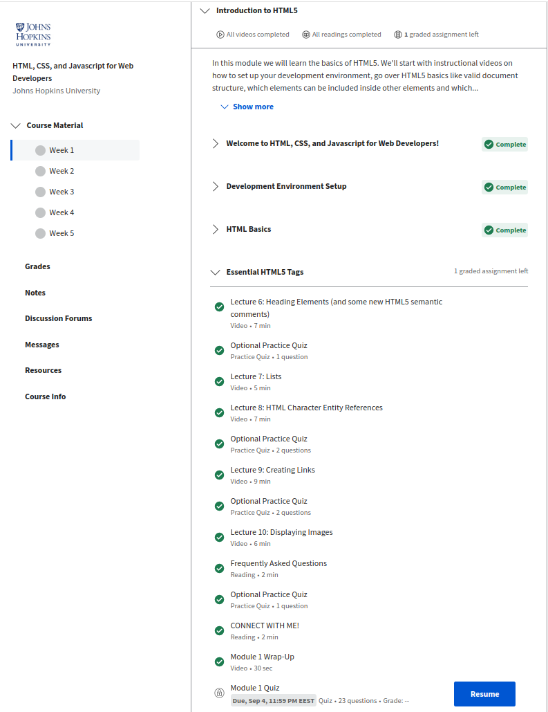
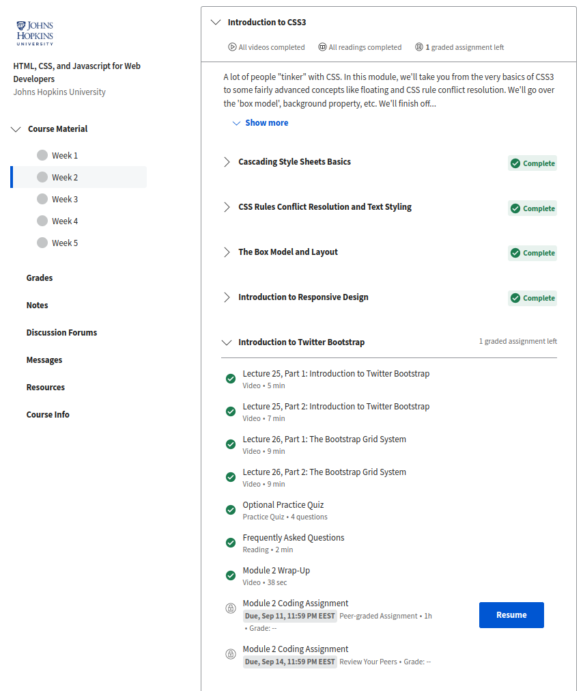
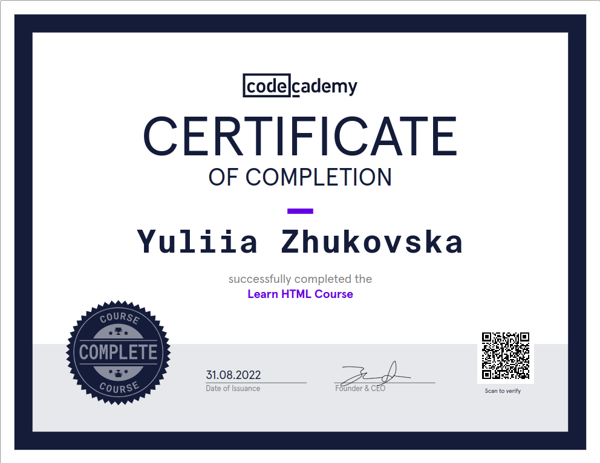
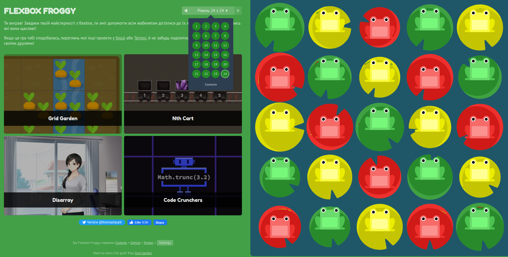
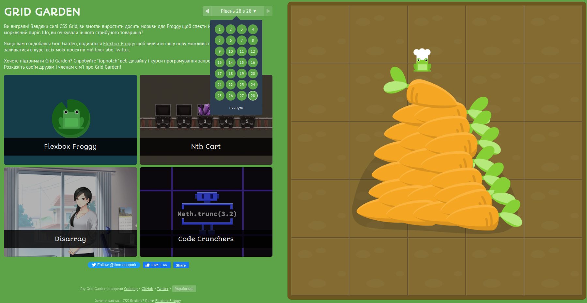

# Hello Kottans! I`m Yuliia from Dnipro city

***Thank you for this opportunity to learn!***

- [x] [*Git and GitHub, Git Collaboration*](#git-and-github-git-collaboration) 
- [x] [*Linux CLI, and HTTP*](#linux-cli-and-http) 
- [x] [*Intro to HTML and CSS*](#intro-to-html-and-css) 
- [x] [*Responsive Web Design*](#responsive-web-design) 

## Git and GitHub, Git Collaboration

I don't understand why these chapters have been divided into 2 parts and I did all the exercises in one go. :sweat_smile:

### First step:

> **Coursera** https://www.coursera.org/learn/introduction-git-github

I studied the materials of the Coursera course and received the certificate.
It was an interesting experience due to the lab works.

SEE THE CERTIFICATE

### Second step:

> **Learn Git Branching** https://learngitbranching.js.org/

SEE THE SCREENSHOT

I opened for myself a command `cherry-pick`. I have not met it before in tutorials :upside_down_face:
And understood the difference between `rebace` and `merge`.

SEE THE SCREENSHOT

I also highlighted the interesting things about  `git fetch/pull/push origin source:destination`

---

## Linux CLI, and HTTP

__Quiz1__ there was the new commands for me `pwd` and `more`.  

__Quiz2__ almost all commands were new to me except `chmod`. But here I was able to understand what these 9 symbols mean and how to edit them.  

__Quiz3__ learned that the command `cat` not only displays the contents of a file, but can also merge files.  

__Quiz4__ at this stage all the commands were new. It was educational!

SEE THE SCREENSHOTS

___

## Intro to HTML and CSS

### First step:

> **Coursera** https://www.coursera.org/learn/html-css-javascript-for-web-developers/

It was a discovery for me that `div` can be placed inside `a`

I understood how units of measurement work `em`

I saw what would happen if I didn't specify `meta name="viewport"`

SEE THE PROGRESS

### Second step: 

> **CodeAcademy HTML** https://www.codecademy.com/learn/learn-html

Learned about the attribute `scope` for `th` and attribute `pattern` for validation form 

SEE THE CERTIFICATE

### Third step:

> **CodeAcademy CSS** https://www.codecademy.com/learn/learn-css

SEE THE CERTIFICATE

___

## Responsive Web Design

The presented materials turned out to be familiar to me, so I cannot single out anything new for myself

SEE THE SCREENSHOT FLEX FROGGY

SEE THE SCREENSHOT GRID GARDEN

