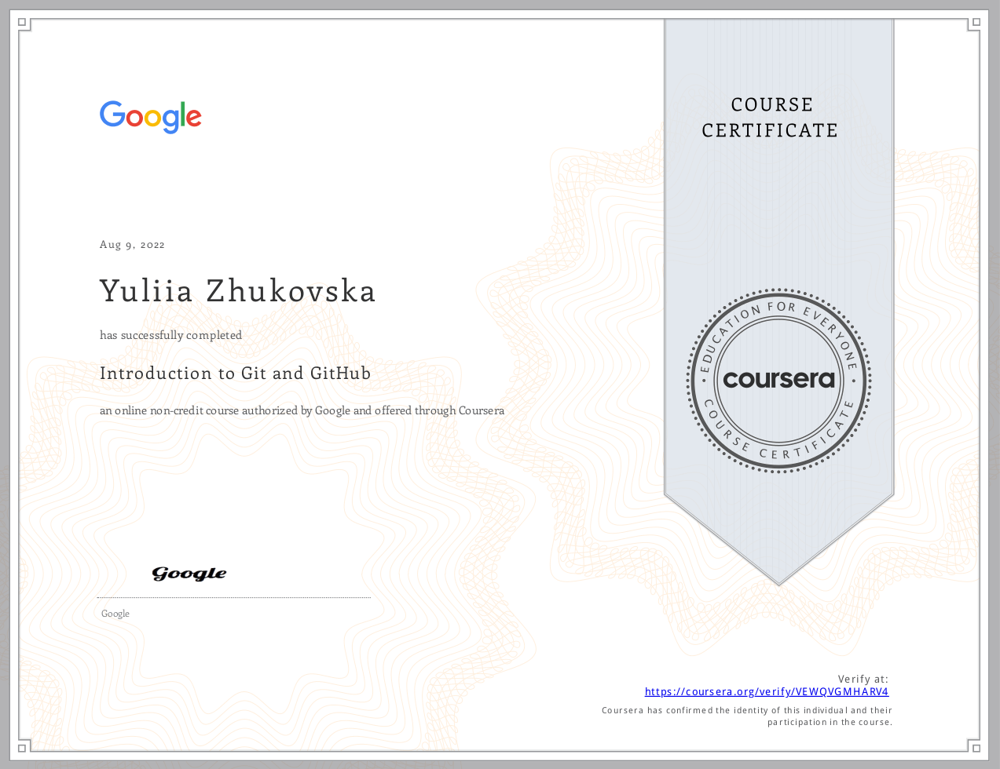
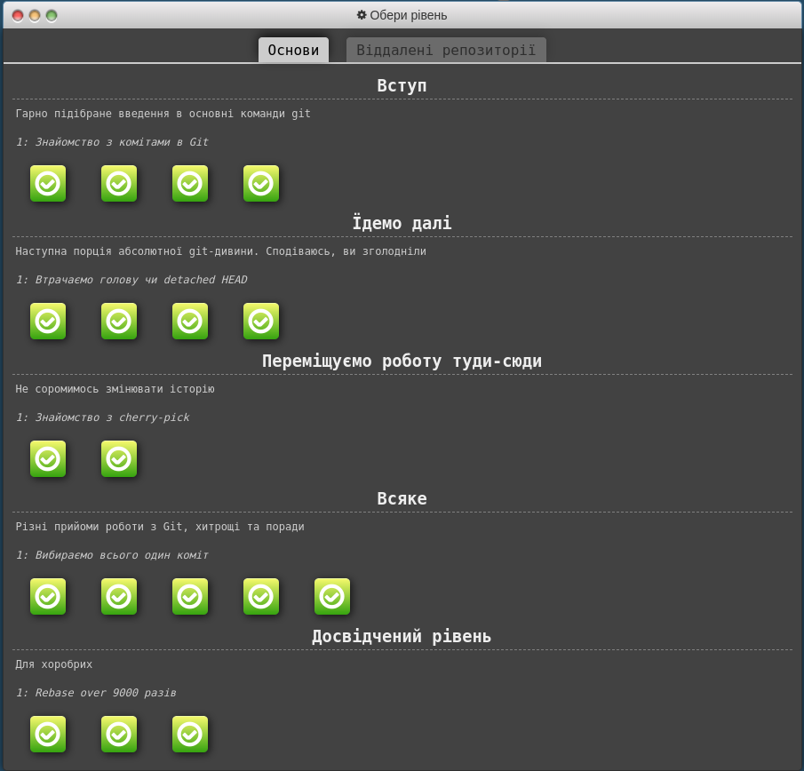
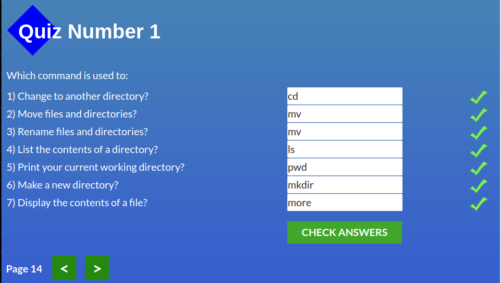
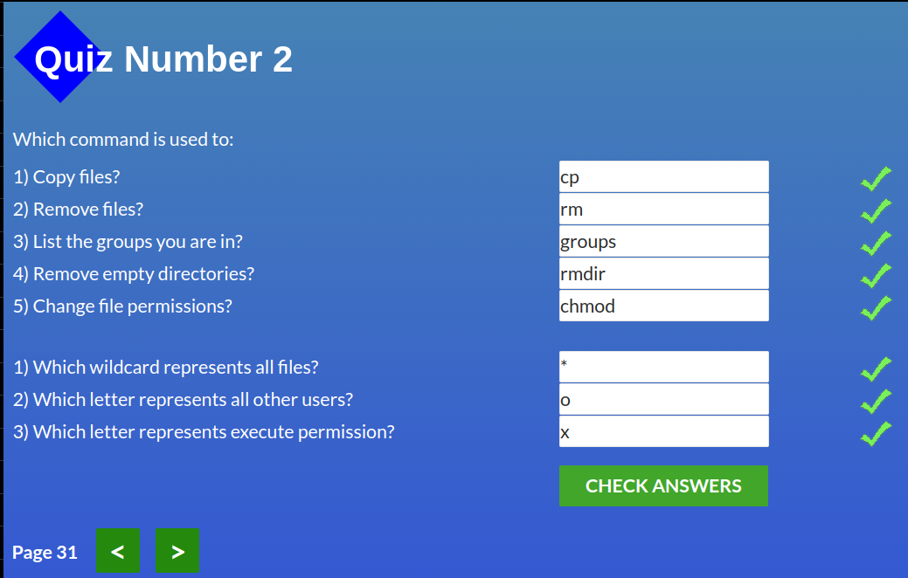
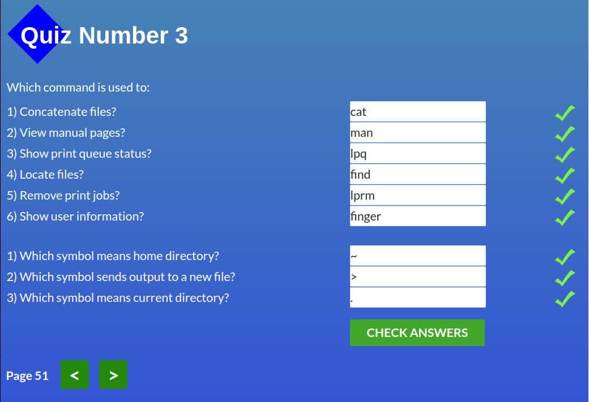
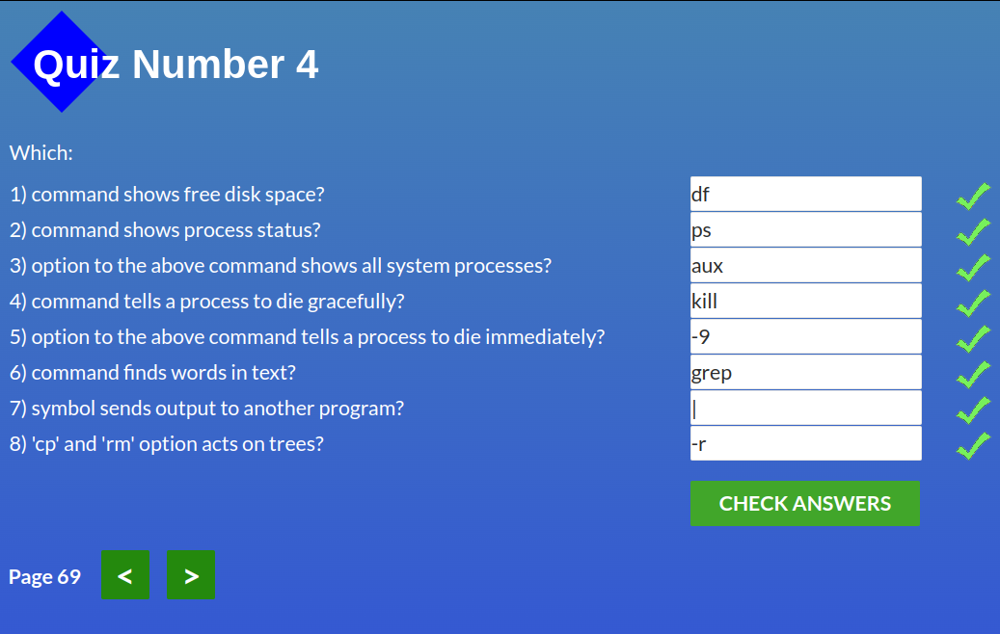

# Hello Kottans! I`m Yuliia from Dnipro city

***Thank you for this opportunity to learn!***

## Git and GitHub

ABOUT MY IMPRESSIONS IN DETAIL

### First step:

> **Coursera** https://www.coursera.org/learn/introduction-git-github

I studied the materials of the Coursera course and received the certificate.
It was an interesting experience due to the lab works.

SEE THE CERTIFICATE

---

### Second step:

> **Learn Git Branching** https://learngitbranching.js.org/

SEE THE SCREENSHOT

I opened for myself a command `cherry-pick`. I have not met it before in tutorials :upside_down_face:
And understood the difference between `rebace` and `merge`.

SEE THE SCREENSHOT

I also highlighted the interesting things about  `git fetch/pull/push origin source:destination`

## Linux CLI, and HTTP

__Quiz1__ there was the new commands for me `pwd` and `more`.  
__Quiz2__ almost all commands were new to me except `chmod`. But here I was able to understand what these 9 symbols mean and how to edit them.  
__Quiz3__ learned that the command `cat` not only displays the contents of a file, but can also merge files.  
__Quiz4__ at this stage all the commands were new. It was educational!

SEE THE SCREENSHOTS

